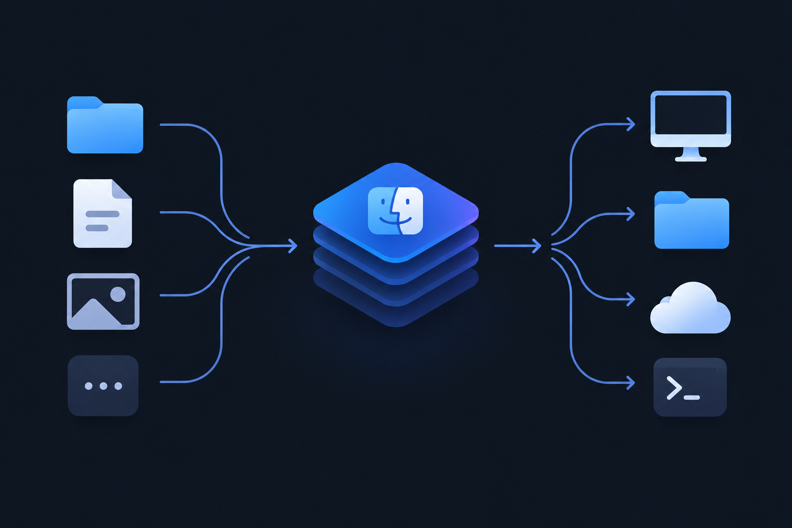

# FileStack



A local-only macOS menu bar shelf for files: drag files in, drag them back
out later. No cloud, no sync, no network access at all — everything lives in
`~/Library/Application Support/FileStack`.

## Features

- **Menu bar icon** — click or hover to open the shelf, even while dragging a
  file over it.
- **Drag in, two ways** — a "Move" zone (removes the original) and a "Copy"
  zone (keeps it) side by side.
- **Drag out** — drop a stashed file anywhere (Finder, another app); it's
  removed from the shelf only once the drop actually succeeds.
- **100% local, no network code** — `grep -rE "URLSession|Network|http" Sources/`
- **English by default, German in Settings.**

## Installation

FileStack isn't notarized or distributed as a signed release, so you build it
from source. This takes a few minutes and doesn't require Xcode.

### 1. Prerequisites

- macOS 14 (Sonoma) or later.
- Xcode Command Line Tools. Check whether you already have them:

  ```bash
  xcode-select -p
  ```

  If that prints a path, you're set. If it errors, install them with:

  ```bash
  xcode-select --install
  ```

  A dialog opens — click **Install** and wait for it to finish (a few
  minutes), then re-run `xcode-select -p` to confirm.

### 2. Clone and build

```bash
git clone https://github.com/aaronbr23/filestack.git
cd filestack
./build.sh
```

`build.sh` compiles a release build with Swift Package Manager, assembles
`FileStack.app` in the project folder, and ad-hoc signs it (so macOS doesn't
re-ask for file-access permissions on every rebuild). It takes under a
minute. If it fails, run it again and read the last few lines of output —
`set -e` means it stops at the first real error.

### 3. Open it

```bash
open FileStack.app
```

Since the app isn't signed by an Apple Developer ID, the first launch may be
blocked by Gatekeeper. If macOS says it "cannot be opened because Apple
cannot check it for malicious software": right-click (or Control-click)
`FileStack.app` → **Open** → confirm **Open** in the dialog. You only need to
do this once.

FileStack has no Dock icon or main window — look for its icon in the menu
bar, top right of the screen, next to the clock.

### 4. Install it permanently (optional)

```bash
mv FileStack.app /Applications/
```

To have it launch automatically at login, open `/Applications`, right-click
`FileStack.app` → open it once from there, then add it in **System Settings
→ General → Login Items**.

## Usage

1. Click (or hover) the menu bar icon to open the shelf.
2. Drag a file onto **Move** (removes it from its original location) or
   **Copy** (leaves the original in place).
3. Drag a stashed file out to Finder, another app, or the Desktop — it
   disappears from the shelf once the drop lands.
4. Right-click an item to reveal it in Finder or remove it directly.
5. Open **Settings** from the shelf's footer to switch the UI language
   (English/German) or clear the shelf entirely.

## Development

```bash
.build/debug/FileStack --selftest    # runs the built-in self-check after `swift build`
```

There's no Xcode project — this is a plain Swift Package. See
[`docs/PLAN.md`](docs/PLAN.md) for the original design notes.

## Privacy

FileStack never makes a network request. Files you stash are copied into
`~/Library/Application Support/FileStack/Stash/`, one folder per item, and
deleted from there the moment you drag them back out (or clear the shelf
from Settings).
